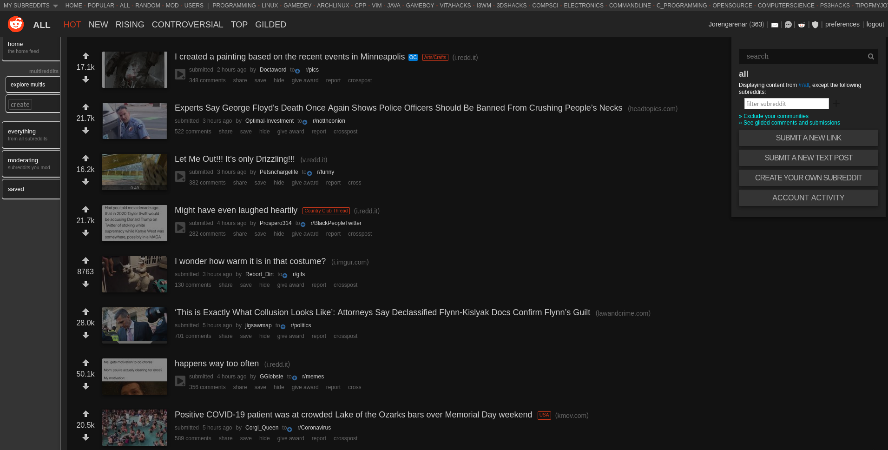

# Reddit Old Redesigned Dark

## Installation

  To install UserStyle you will first need to install
  [Stylus](https://github.com/openstyles/stylus) browser add-on. Then just:

  [INSTALL THIS USERSTYLE](https://raw.githubusercontent.com/Jorengarenar/RedditOldRedesignedDark/master/RedditOldRedesignedDark.user.css)

  For this style to work properly, you need to uncheck
  "_allow subreddits to show me custom themes_" in your
  [preferences settings](https://old.reddit.com/prefs)

---

### Based on [this style](https://userstyles.org/styles/75410)

Copyright  2005-2014  [Globex Designs, Inc.](https://userstyles.org/users/6943) CC BY - Creative Commons Attribution

---

Check also [my other UserStyles](https://github.com/Jorengarenar/userstyles)
