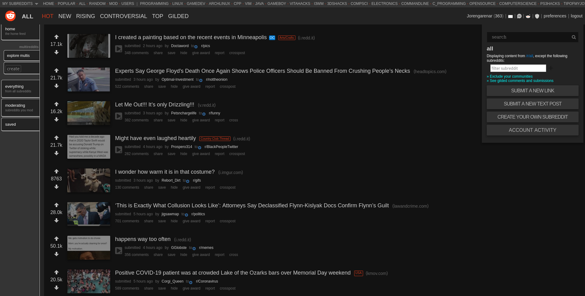

# Reddit Old Redesigned Dark

## Installation

To install UserStyle you will first need to install [Stylus](https://github.com/openstyles/stylus) browser add-on.

Then [open raw file to install userstyle](https://raw.githubusercontent.com/Jorenar/RedditOldRedesignedDark/master/RedditOldRedesignedDark.user.css)

**For style to work properly you need to either:**
  * uncheck "_allow subreddits to show me custom themes_" in Reddit [preferences](https://old.reddit.com/prefs),
  * or add filter `reddit.com##^link[title="applied_subreddit_stylesheet"]` to adblocker like [uBlock Origin](https://ublockorigin.com/).

## Acknowledgments

This style is a rewrite of [Reddit Redesigned](https://userstyles.org/styles/75410)
by [Globex Designs, Inc.](https://userstyles.org/users/6943)
