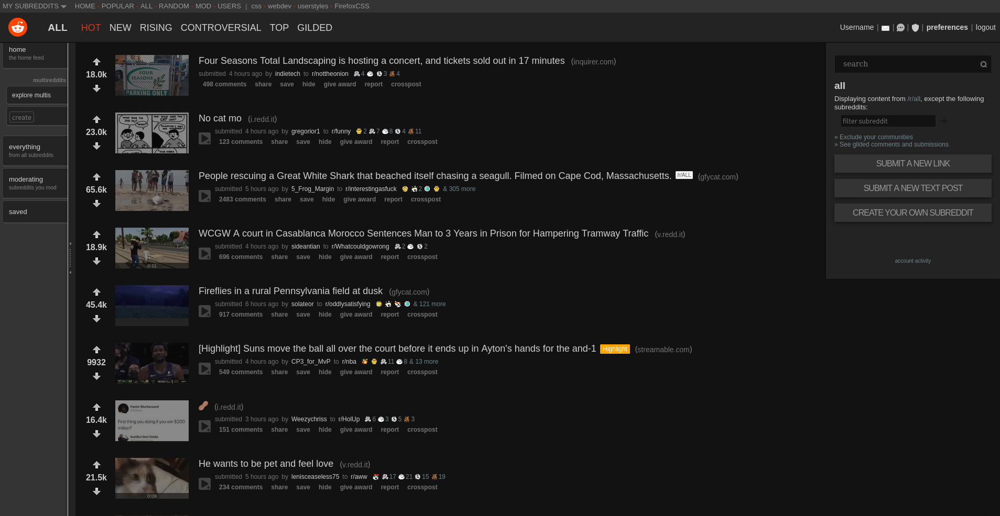

# Reddit Old Redesigned Dark

## Installation

  To install Userstyle you will first need to install [Stylus](https://github.com/openstyles/stylus)
  browser add-on. Then just:

  [INSTALL THIS USERSTYLE](https://raw.githubusercontent.com/Jorengarenar/RedditOldRedesignedDark/master/RedditOldRedesignedDark.user.css)

---

### Based on [this style](https://userstyles.org/styles/75410)

Copyright  2005-2014  [Globex Designs, Inc.](https://userstyles.org/users/6943) CC BY - Creative Commons Attribution

---

Check also [my other Userstyles](https://github.com/Jorengarenar/userstyles)
